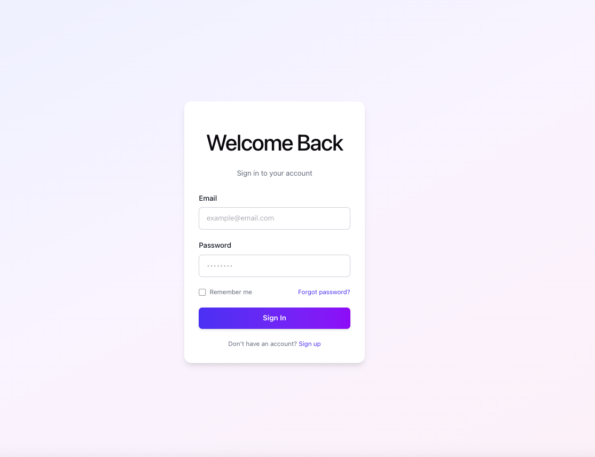
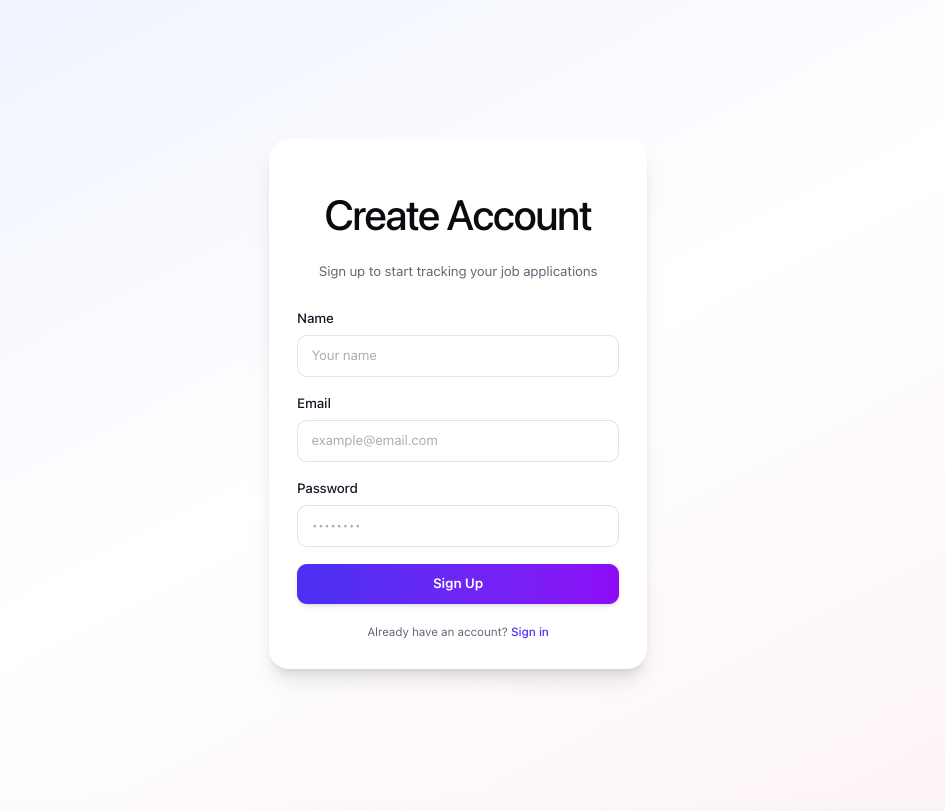
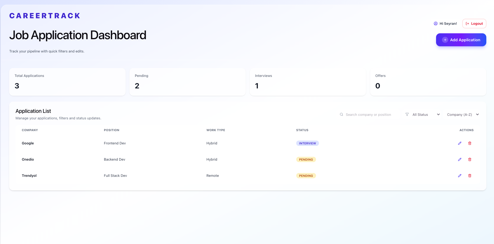
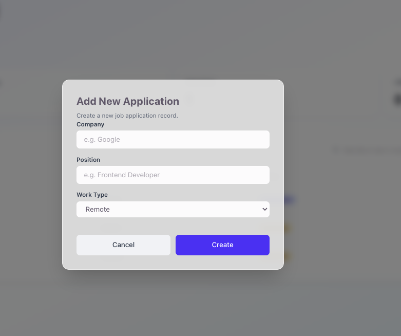
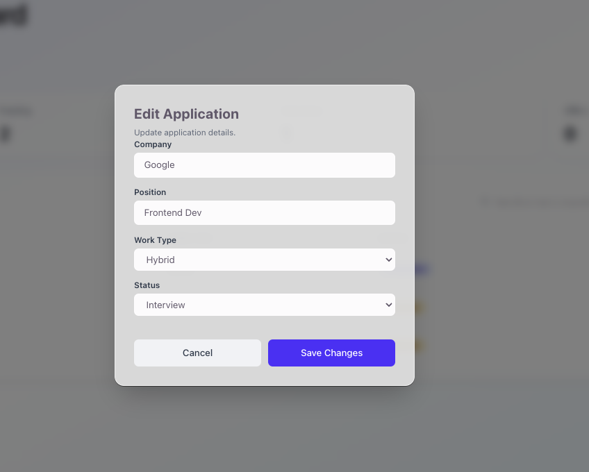
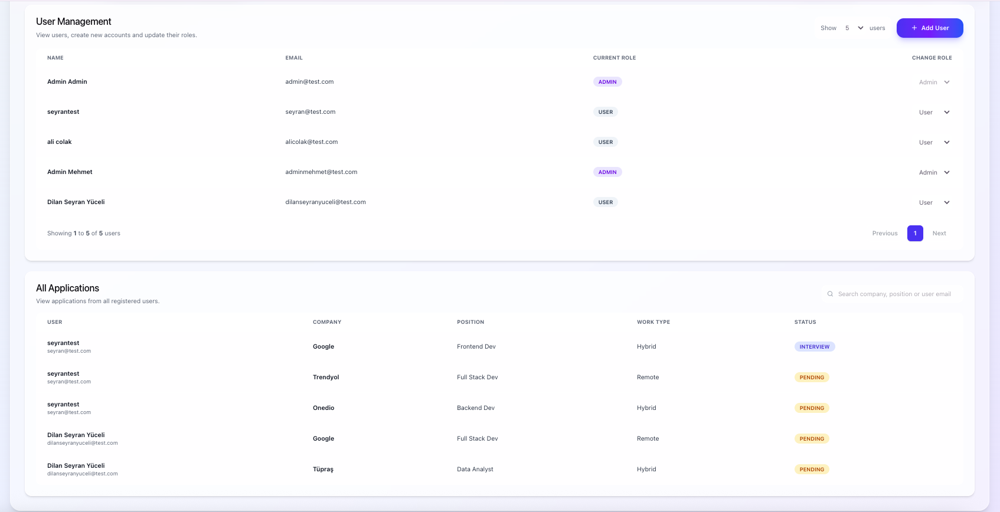
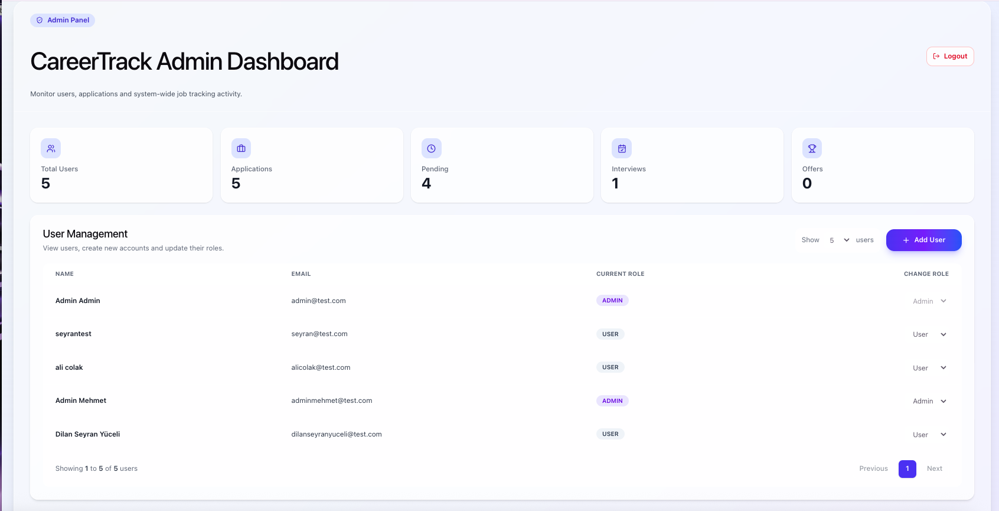
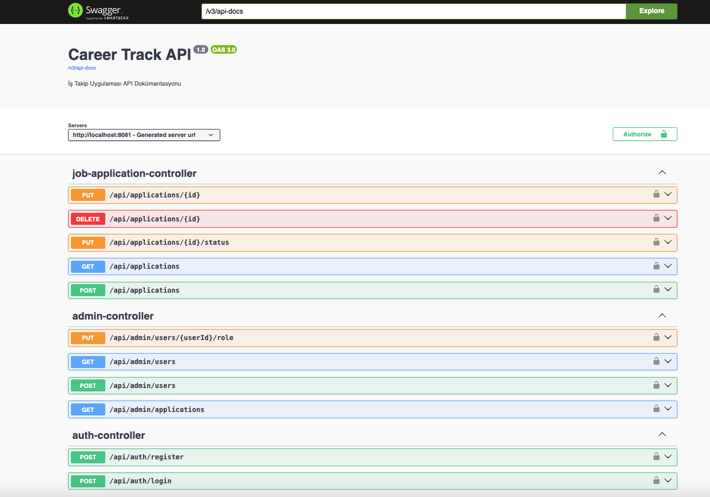

# CareerTrack Dashboard Panel

CareerTrack is a full-stack job application tracking dashboard built with React, Spring Boot, PostgreSQL, JWT authentication, and role-based access control.

The project includes separate user and admin flows. Regular users can manage their own job applications, while admins can view system-wide data, manage users, create new users, and update user roles.

## Features

### User Features
- Sign up and login
- JWT-based authentication
- Protected user dashboard
- Add new job applications
- Edit company, position, work type, and status
- Delete job applications
- Search, filter, and sort applications
- Dashboard statistics

### Admin Features
- Role-based admin dashboard
- View all users
- View all job applications
- Add new users from admin panel
- Update user roles between USER and ADMIN
- User management pagination
- System-wide application statistics

## Tech Stack

### Frontend
- React
- Vite
- JavaScript
- Tailwind CSS
- React Router
- Axios
- Lucide React

### Backend
- Java
- Spring Boot
- Spring Security
- JWT
- Spring Data JPA
- PostgreSQL
- Lombok

## Screenshots

### Login Page


### Sign Up Mode


### User Dashboard


### Add Application Modal


### Edit Application Modal


### Admin Dashboard


### User Management


## Project Structure

```txt
careertrack-dashboard-panel/
├── careertrack-fe/
│   ├── src/
│   ├── package.json
│   └── vite.config.js
│
├── careertrack-be/
│   ├── src/
│   ├── pom.xml
│   └── application.properties
│
├── screenshots/
└── README.md

Authentication Flow

After login, the backend returns a JWT token and user role.

{
  "token": "jwt-token",
  "role": "USER"
}
The frontend stores the token and role in localStorage. Based on the role, the user is redirected:

USER  -> /dashboard
ADMIN -> /admin-dashboard

Protected routes prevent unauthenticated users from accessing private pages. Admin routes also check the user role before rendering admin-only pages.
API Overview
Auth
POST /api/auth/register
POST /api/auth/login
User Applications
GET    /api/applications
POST   /api/applications
PUT    /api/applications/{id}
DELETE /api/applications/{id}
Admin
GET  /api/admin/users
POST /api/admin/users
PUT  /api/admin/users/{userId}/role
GET  /api/admin/applications
How to Run
Backend
cd careertrack-be
./mvnw spring-boot:run

Backend runs on:

http://localhost:8081
Frontend
cd careertrack-fe
npm install
npm run dev

Frontend runs on:

http://localhost:5173
Notes

This project was built as a portfolio project to demonstrate full-stack development, authentication, authorization, REST API integration, role-based routing, and admin dashboard management.


---
### Swagger API Documentation

